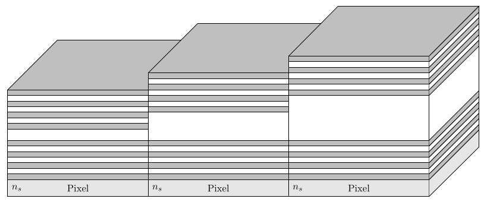
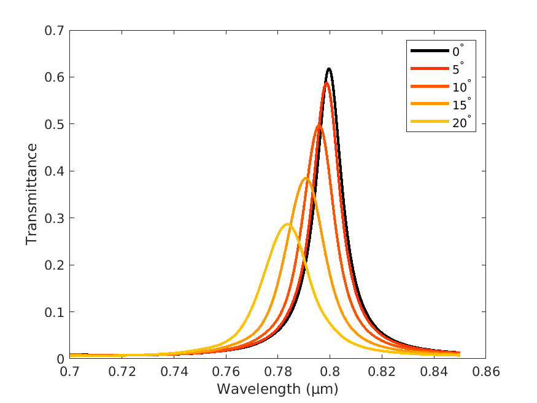
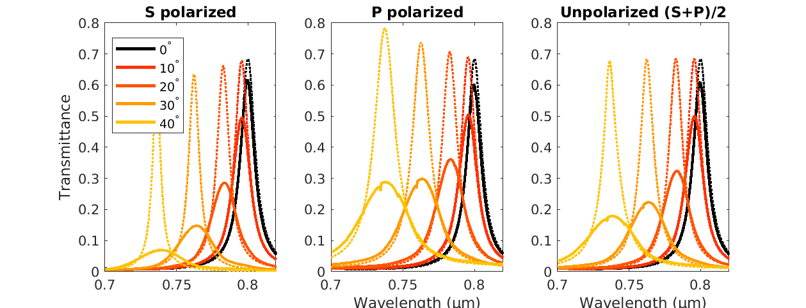
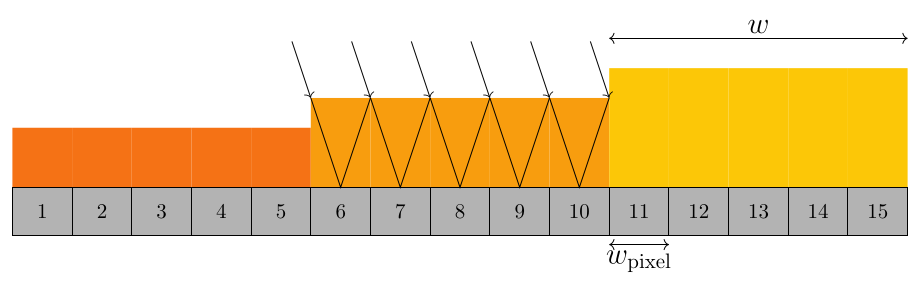
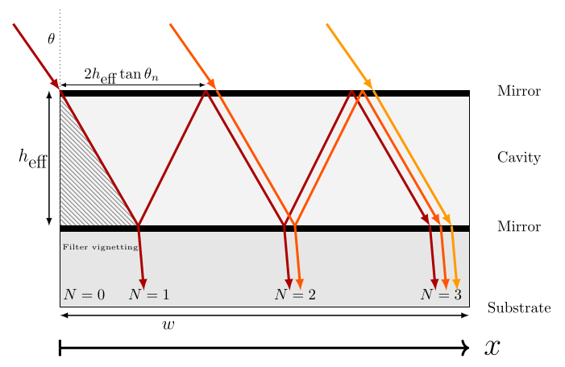

# Tiny Thin Film Filter Toolbox
Calculate the transmittance of pixel-integrated thin-film filters.

Thin-film filter deposition technology has advanced to the stage where filters can be made so tiny that they can be integrated onto separate pixels of image sensors.
This trend has mainly been driven by the need for developing compact and lightweight spectral cameras that aim to combine imaging and spectroscopy. 

The pixel-integrated thin-film filters are used to select specific wavelengths. The spatial width, however, strongly affects the angular sensitivity of thin-film filters.
This is problematic when the sensors are used with an imaging lens and needs to be taken into account at the design stage.

This toolbox aims to provide filter and camera designers with quick estimates of the expected filter transmittance. Or alternatively, better understand measured responses of filter arrays.

It is designed to be compatible with MATLAB and the free alternative Octave for most features.

<!--  -->

# 2D Simulation Features
## Fast simulation of pixel-integrated thin-film filter transmittance
Based on an aperture-diffraction model, the toolbox allows
- Efficient transmittance calculation compared to numerical solvers like FDFD or Finite Element
- Exploration of the effect of the pixel and filter width
- Exploration of the effect of the angle of incidence 
- Simulate for s and p polarization

## Filters across multiple pixels
The filters deposited on the pixels can be larger than the individual pixels. Not every pixel will observe the same transmittance.
See Examples.

## Simulate without knowing the filter design using an equivalent model
Using an equivalent monolayer model, the behavior of a filter can be predicted <b>without knowing its actual filter design</b>.
See linked article for more explanation and 'Examples' for an example usage.

## Fast Ray-Optics Approximation
The toolbox implements an analytical solution to the equivalent monolayer model that predicts the tiny filter transmittance much faster than the wave-optics approach.
Only for small pixels, where diffraction becomes relevant, there will be important differences at normal incidence.

## Perfectly reflecting boundaries approximation (Experimental)
Estimate filter response for perfectly reflective boundaries. Because only a finite number of spatial modes can exist, multiple shifted peaks occur. The modes are assumed to be uncoupled.
This is mainly meant as an exploratory limit case to better understand some of the discrepancies of the diffraction model for small pixels. Check for example the Validation 'filterarray' for the 2 µm pixel, where at normal incidence a peak shift occurs and at 20 degrees multiple peaks are observed. It is the hypothesis that for these small pixels the filter acts partially as a waveguide.

# 3D Simulation Features (Not yet validated)
These scripts are a generalization of the equations developed and validated for the 2D case. Numerical and experimental validation for the focused light cases
is still lacking.

 ##  Very fast Ray Optics approximation
- Focused light from ideal circular lens
- Focused light from lenses with vignetting

 ## Wave optics
- Light focused from circular apertures: on and off-axis
- Plane wave in 3D space

# Example Gallery
All aspects of the toolbox are illustrated using relevant examples.
See directory 'examples'.

## Example scripts
Many examples showing how the code can be used for 2D and 3D simulations with collimated, focused light, vignetted lenses etc.

## FDFD Validations
Some numerical validations are provided based on Finite Difference Frequency Domain calculations (using the MaxwellFDFD toolbox).

## Spectral imaging
Example scripts to efficiently simulate the effect on measured spectra using spectral cameras with pixel-integrated thin-film filters.

# How to cite this work
T. Goossens, Pixel-integrated thin-film filter simulation and scaling trade-offs, arXiv:2106.01147

T. Goossens, Tiny thin-film filter toolbox, 2021. https://github.com/tgoossens/tinythinfilm

# Related work
Goossens, Thomas. "Tiny thin-film filters from a different angle: Correcting angular dependency for spectral imaging.", PhD Thesis (2020).  

